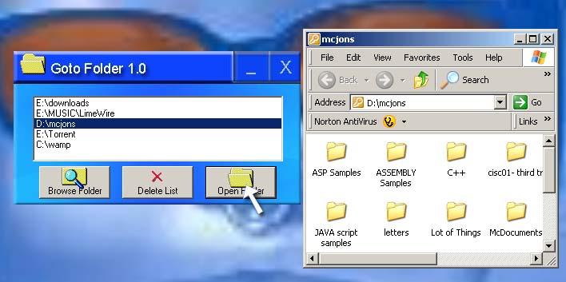



## Goto folder

### Description

Simple but useful application. Add the location of your most viewed folder and then thats it you can view your folder anytime you want with a click of a button. No need for more links when your going to open your desired folder. don't bother to rate this i know its a simple application.
 
### More Info
 

             |
---                |---
**Submitted On**   |2007-03-22 02:26:30
**By**             |[mcjons](https://github.com/Planet-Source-Code/PSCIndex/blob/master/ByAuthor/mcjons.md)
**Level**          |Beginner
**User Rating**    |4.0 (8 globes from 2 users)
**Compatibility**  |VB 6\.0
**Category**       |[Miscellaneous](https://github.com/Planet-Source-Code/PSCIndex/blob/master/ByCategory/miscellaneous__1-1.md)
**World**          |[Visual Basic](https://github.com/Planet-Source-Code/PSCIndex/blob/master/ByWorld/visual-basic.md)
**Archive File**   |[Goto\_folde2055463222007\.zip](https://github.com/Planet-Source-Code/mcjons-goto-folder__1-68193/archive/master.zip)

